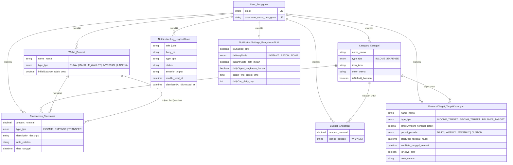

# Moneta Finance — Architecture Summary

**Last Updated**: 2026-05  
**Status**: Single Source of Truth for current Moneta offline-first architecture  
**Scope**: PWA, IndexedDB, sync_queue, notifications, hydration, push/pull sync, and AI implementation guardrails  

**Moneta** is an **offline-first personal finance PWA** built with **Next.js 16**, **TypeScript**, **Prisma/PostgreSQL**, and **IndexedDB** for local persistence. It features bidirectional sync, push notifications, and JWT-based auth.

---

## Source of Truth Rules

To maintain absolute data integrity across offline operations:
- **UI Local-First**: The UI must read from IndexedDB/local DB first. 
- **Server Role**: For offline-first domain data, PostgreSQL/server acts as the durable multi-device persistence layer. The server also distinctly handles authentication, export, sync endpoints, web push subscriptions, and background digest/reminder jobs.
- **Data Flow**: Server data reaches the UI strictly through hydration/pull sync into IndexedDB. 
- **No Direct Fetching**: The UI should never bypass IndexedDB with direct server fetches for offline-first data (e.g., no online-only `layout.tsx` API fallbacks).

### Server-Only / Online-Required Exceptions
While offline-first applies to core user data, the following specific tasks are naturally online-required and may call server APIs directly:
- Authentication (`/api/auth/*`)
- Export to XLSX (`/api/export`)
- Push Subscription Registration (`/api/notifications/subscribe`)
- Push Notification Tests (`/api/notifications/test`)
- Server-Scheduled Digest/Reminder Jobs
- Sync Push/Pull Endpoints (`/api/sync/push`, `/api/sync/pull`)

---

## Tech Stack

| Layer | Technology |
|---|---|
| Framework | Next.js 16 (App Router) |
| Language | TypeScript |
| Styling | Tailwind CSS v4, PostCSS |
| ORM / DB | Prisma → PostgreSQL |
| Local DB | IndexedDB (via `idb` library) |
| Auth | JWT (`jose`) + bcrypt (`bcryptjs`) |
| PWA | `@ducanh2912/next-pwa`, Service Worker |
| Push Notifications | Web Push API (`web-push`) |
| UI Toasts | `sonner` |

---

## Core Architecture & Local-First Philosophy

### 1. IndexedDB as Local Working Copy
All user data is **written to IndexedDB first**. The app remains fully functional without connectivity, routing all queries and mutations through local repositories before syncing to the server.

### 2. Initial Offline Limitation
Offline-first does not mean the app functions magically before initial hydration. If the local DB is empty and the user is offline upon first load, the app must show an offline empty state and request the user to connect once for initial synchronization.

### 3. Deletion Strategy
Offline deletions are handled via **soft deletes** (`deletedAt` or `syncStatus = "DELETED"`). Deletion mutations are enqueued locally and pushed to the server to guarantee they are not silently dropped before successful synchronization.

### 4. Frontend UI/UX Standardization
- Moneta uses a consistent dark, card-based interface.
- UI changes should follow `docs/FRONTEND_UI_GUIDELINES.md`.
- Entity actions use standardized edit/delete patterns (action menus and bottom sheets).
- Mobile layout prioritizes compactness and avoids hover-only interactions.
- UI feedback must support offline-first behavior (optimistic updates and local-first rendering).

---

## Data Models (Prisma)


*(Diagram di atas merupakan representasi domain murni (lugu) dan sengaja tidak menampilkan field-field teknis server/sinkronisasi seperti `id`, `clientId`, `syncStatus`, `createdAt`, `updatedAt`, maupun `deletedAt`.)*

**Note on Budget Reallocation (Subsidi Silang)**: Budget reallocation is implemented as two local budget updates (source budget amount decreases, destination budget amount increases). Both updates are stored locally and synchronized through the normal budget update sync path. No separate reallocation entity is used in the current version.

---

## Sync Mechanics (The Engine)

### 1. Remote Apply vs Local Mutation Rule
This is critical to prevent infinite sync loops (especially for logs and settings):
- **Local Mutation**: Saving a local change → **Enqueue** into `sync_queue` (`syncStatus = PENDING`).
- **Remote Apply**: Saving data pulled from the server/hydration → **Do not enqueue** into `sync_queue` (`skipSyncQueue = true`, `syncStatus = SYNCED`).

### 2. Hydration & Pull Sync (Sinkronisasi Pull Progresif)
- **Hydration**: On fresh login, the client pulls historical data (`mode=hydrate`). The current implementation applies a bounded **3-month history window** for transactions during hydration to ensure performance, but includes all required entities for offline operation.
- **Delta Pull**: Routine sync calls `/api/sync/pull?lastSyncedAt=XYZ`. Returns only records modified since `lastSyncedAt`.
- **Progressive UI Updates**: To ensure responsiveness, the UI uses `useLiveQuery` and instantly renders data as each entity finishes hydrating into IndexedDB. This Progressive Pull Sync prevents the UI from freezing while waiting for a large sync cycle to complete.

### 3. Push Sync & Dependency Order
The `sync_queue` batches local mutations and sends them to `/api/sync/push`. The server strictly enforces the following resolution sequence to prevent foreign key constraint failures:
1. **Categories / Wallets**
2. **Targets** (Depends on Categories)
3. **Budgets** (Depends on Categories)
4. **Transactions** (Depends on Categories & Wallets)
5. **Notification Settings**
6. **Notification Logs** (Must resolve last as they reference Transactions/Budgets/Targets)

### 4. Sync Queue Drain Loop (Concurrency Safety)
To prevent missed syncs when a user creates new items *during* an active sync, the Sync Manager utilizes a controlled drain loop (`MAX_DRAIN_CYCLES = 3`).
- If a new mutation enters the queue while `isSyncing === true`, the manager flags `syncRequestedAgain`.
- Upon completion of a push/pull cycle, it checks this flag. If `true` and there are active pending items, it immediately executes another sync cycle.
- This guarantees no items get stranded in a "Waiting for next cycle" UI state while respecting the strict single-thread sync rule (no concurrent push runs).

### 5. Conflict Resolution
Moneta uses a **Last-Write-Wins** strategy based on the `updatedAt` timestamp.
- Applied uniformly across core entities, `notification_settings`, and `notification_logs`.
- If the local record has `syncStatus = PENDING` and its `updatedAt` is newer than the pulled server record, the local version is retained.
- If the server version is newer, the server version overwrites the local record and is marked `SYNCED` (`skipSyncQueue=true`).

### 6. Server-Side Sync Performance Optimization
To ensure sync scalability (especially when accumulated offline changes are pushed at once), the sync operations were optimized to eliminate N+1 query patterns:
- **Before:** Sequential database lookups and writes for each sync item inside a loop, which accumulated network/database latency with larger payloads.
- **After:** Existing records and related entities (like wallets and categories) are fetched in batches before processing the payload items. This minimizes sequential lookups, reduces repeated database round trips, and keeps database transactions focused and efficient while maintaining correctness between local IndexedDB state and server-side database state.

---

## Notification Subsystem

### 1. Notification Settings Local-First Behavior
- The `notification_settings` IDB store is the definitive source of truth.
- The Service Worker queries IDB directly—it **does not** rely on `localStorage` cache.
- Offline edits are saved to IDB as `PENDING` and enqueued for sync.

### 2. Notification Logs Sync
- Local logs (e.g. over-budget warnings) are created locally, immediately enqueued, and pushed.
- **Explicit Rule:** Pulled notification logs are history records, not new notification events. They must update the notification center only and must never call `showNotification()`. They also skip the `sync_queue`.
- Read/Dismiss states are updated locally, modifying `readAt`/`dismissedAt` and `updatedAt`, queuing a push.

### 3. Tiered Notification Dedupe Rule
A strict `dedupeKey` prevents duplicate alerts. To allow escalating warnings, tiers are separated into unique dedupe keys using exact integer thresholds (`20`, `50`, `100`).
*Example:* `BUDGET_USAGE:userId:budgetId:YYYY-MM:20` is distinct from `BUDGET_USAGE:userId:budgetId:YYYY-MM:100`.
- The local engine evaluates thresholds in descending order (`100 -> 50 -> 20`).
- It triggers at most one notification per transaction to prevent spam.

### 4. Server Web Push vs Device Subscriptions
- **Server Web Push**: Used for background jobs (Digest batches, Daily Reminders).
- **Device-Specific Subscriptions**: `NotificationSubscription` models are bound to a specific browser/device push endpoint. They are **not** hydrated to other devices to prevent cross-device push token pollution.

---

## Directory Structure & API Routes

```text
src/
├── app/
│   ├── (auth)/            # Login, Register
│   ├── (dashboard)/       # Main app pages (purely local-first data reads)
│   ├── api/               # REST API routes
│   │   ├── auth/          # login, logout, register, me
│   │   ├── notifications/ # subscribe, test
│   │   └── sync/          # unified push/pull endpoints
├── components/            # React Components (PascalCase.tsx)
│   ├── analytics/         # Domain-specific components
│   ├── budgets/
│   ├── categories/
│   ├── layout/            # Shared layout wrappers (nav, header)
│   ├── notifications/
│   ├── transactions/
│   ├── ui/                # Generic, reusable UI primitives
│   └── wallets/
├── hooks/                 # Custom React hooks (use-kebab-case.ts)
├── lib/
│   ├── auth/
│   ├── db/                # Prisma client
│   ├── local-db/          # IndexedDB schema, sync-queue, & repos (kebab-case.ts)
│   ├── notifications/
│   ├── sw/                # Service worker registration
│   ├── sync/              # sync-manager.ts, conflict-resolver.ts
│   └── utils/
├── providers/             # React Context providers (PascalCase.tsx)
├── types/                 # Shared type definitions (*.types.ts)
├── worker/
│   └── index.ts           # Service worker background logic
```

### Naming Conventions
- **Folders**: `kebab-case`
- **React Components**: `PascalCase.tsx`
- **Hooks**: `use-kebab-case.ts`
- **Local DB Repositories**: Plural entity names in `kebab-case.ts`
- **Types**: `*.types.ts`

### Core API Routes
| Route | Purpose |
|---|---|
| `POST /api/sync/push` | Receive batched client mutations via `sync_queue` |
| `GET /api/sync/pull` | Return server deltas since timestamp or hydrate initial data |
| `POST /api/notifications/subscribe` | Register device-specific push subscription |
| `POST /api/notifications/test` | Trigger a test web push notification |

---

## Key Design Decisions & Guardrails

| Decision | Rationale |
|---|---|
| UUIDs everywhere | Prevents ID collisions across offline clients |
| `clientId` on every offline-synced user data table | The definitive sync anchor between IndexedDB and PostgreSQL |
| `Decimal(15,2)` for amounts | Avoids floating-point rounding in financial calculations |
| Denormalized `type` on Transaction | Faster analytics queries without category joins |
| Push-then-pull sync order | Ensures local changes reach the server before pulling updates |

### Post-Implementation Audit Checklist (AI Do-Not Rules)
Any future changes to hydration, sync, local DB, or notifications **MUST** be checked against these rules:
- [ ] UI still reads local DB first. Do not bypass IDB with `fetch()` calls in components.
- [ ] Hydration includes all required entities.
- [ ] Remote apply does not enqueue `sync_queue`.
- [ ] Pulled notification logs do not re-trigger system notifications.
- [ ] `notification_subscriptions` remain device-specific and are never pulled/hydrated to a different device.
- [ ] Push dependency order remains structurally safe.
- [ ] Settings and logs exclusively use `resolveConflict` based on `updatedAt`.
- [ ] Read/dismiss notification offline still enters `sync_queue` and syncs later.
