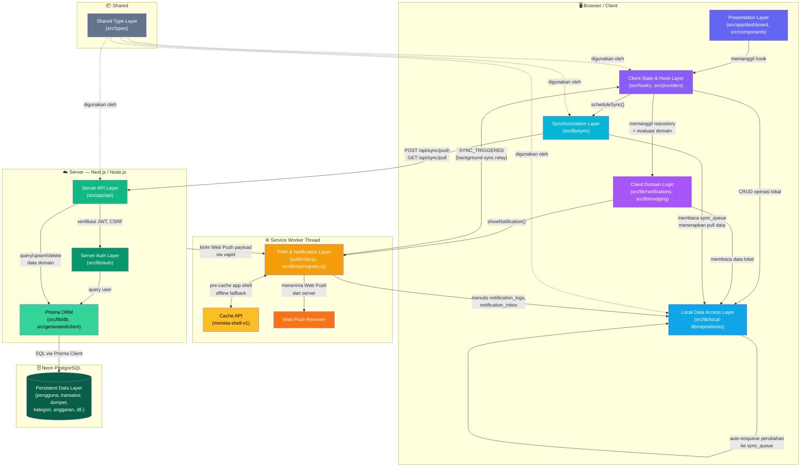

# Audit Arsitektur Perangkat Lunak — Moneta Finance

## Hasil Reverse Engineering untuk Subbab 2.1.2 DPPL

> **Catatan**: Seluruh kesimpulan dalam dokumen ini didasarkan pada analisis file dan fungsi aktual yang ditemukan pada codebase `c:\moneta-finance-final-project`. Tidak ada modul yang dikarang tanpa bukti pada codebase.

---

## 1. Identifikasi Pola Arsitektur Utama

### Kesimpulan Utama

Aplikasi Moneta Finance menggunakan **kombinasi tiga pola arsitektur** secara berlapis:

| Pola Arsitektur                     | Ditemukan Pada                                                                                                        | Status                |
| ----------------------------------- | --------------------------------------------------------------------------------------------------------------------- | --------------------- |
| **Offline-First Architecture**      | Seluruh alur mutasi data domain; UI membaca IndexedDB, server sebagai sinkronisasi                                    | Confirmed by codebase |
| **Layered (N-Layer) Architecture**  | Pembagian tanggung jawab yang jelas: UI → Hooks → Repositories → Sync → API → ORM → DB                                | Confirmed by codebase |
| **Feature-Based Modular Structure** | Folder `src/components/transactions`, `budgets`, `wallets`, dll.; `src/app/(dashboard)/transactions`, `budgets`, dll. | Confirmed by codebase |

### Alasan Teknis

**Offline-First** dikonfirmasi oleh:

- Komentar pada `src/lib/local-db/repositories/transactions.ts` baris 3–7: _"Architecture: Local-First — UI reads/writes ONLY to IndexedDB through these functions. All mutations auto-enqueue to sync_queue."_
- Komentar pada `src/app/(dashboard)/page.tsx` baris 22: _"Offline-first: semua data dari IndexedDB."_
- `src/hooks/use-transactions.ts` baris 3–4: _"React hook for managing transactions through IndexedDB. Local-first: reads/writes exclusively to IndexedDB, never directly to the server API."_
- Seluruh hook domain (`use-transactions`, `use-wallets`, `use-categories`, dll.) hanya memanggil `@/lib/local-db/repositories/*`, tidak pernah memanggil `/api/*` secara langsung.

**N-Layer Architecture** dikonfirmasi oleh hierarki ketergantungan yang konsisten dan searah:

```
UI Page/Component → Hook → Repository (IndexedDB) → Sync Queue → Sync Manager → API Route → Prisma → PostgreSQL
```

---

## 2. Identifikasi dan Pemetaan Layer/Package Utama

### Layer 1: Presentation Layer (Client UI)

- **Lokasi**: `src/app/(auth)/`, `src/app/(dashboard)/`, `src/components/`
- **File penting**:
  - `src/app/(dashboard)/page.tsx` — Halaman beranda/dashboard
  - `src/app/(dashboard)/transactions/` — Halaman manajemen transaksi
  - `src/app/(dashboard)/budgets/` — Halaman manajemen anggaran
  - `src/components/transactions/TransactionItem.tsx`
  - `src/components/budgets/BudgetHealthBar.tsx`
  - `src/components/layout/` — Komponen navigasi dan shell
- **Berjalan di**: Client (browser)
- **Dependensi ke**: Layer 2 (Hooks/Providers)

### Layer 2: Client State & Hook Layer

- **Lokasi**: `src/hooks/`, `src/providers/`
- **File penting**:
  - `src/hooks/use-transactions.ts` — CRUD transaksi + optimistic update
  - `src/hooks/use-wallets.ts` — Dompet dan saldo terhitung
  - `src/hooks/use-categories.ts` — Manajemen kategori
  - `src/hooks/use-budgets.ts` — Pengelolaan anggaran (tidak disebutkan eksplisit, kemungkinan di dalam hooks lain)
  - `src/hooks/use-sync.ts` — Status sinkronisasi + kontrol siklus sync
  - `src/hooks/use-hydration.ts` — Hidras awal IndexedDB dari server
  - `src/hooks/use-analytics.ts` — Kalkulasi analitik keuangan
  - `src/providers/SyncProvider.tsx` — Context React untuk distribusi state sync
  - `src/providers/TransactionFormProvider.tsx` — State form transaksi global
  - `src/providers/TimeFilterProvider.tsx` — Filter rentang waktu global
  - `src/providers/ThemeProvider.tsx` — Mode gelap/terang
- **Berjalan di**: Client
- **Dependensi ke**: Layer 3 (Domain Logic), Layer 4 (Local DB)

### Layer 3: Client Domain Logic Layer

- **Lokasi**: `src/lib/notifications/`, `src/lib/nudging.ts`, `src/lib/utils/`
- **File penting**:
  - `src/lib/notifications/local-engine.ts` — Mesin evaluasi nudge dan notifikasi berbasis data lokal (~700 baris)
  - `src/lib/nudging.ts` — Generator insight keuangan perilaku
  - `src/lib/notifications/budget-gateways.ts` — Gateway validasi anggaran
  - `src/lib/notifications/daily-digest.ts` — Logika fallback / klien digest harian (historis)
  - `src/lib/notifications/server-digest.ts` — Helper logika digest sisi server (PostgreSQL -> Web Push)
  - `src/lib/utils/helpers.ts`, `date-utils.ts`, `budget-rhythm.ts`, dll. — Fungsi utilitas domain
  - `src/lib/utils/parse-mutation.ts` — Parsing mutasi data
- **Berjalan di**: Client
- **Dependensi ke**: Layer 4 (Local DB Repositories), Layer 6 (Service Worker — untuk trigger notifikasi)

### Layer 4: Local Data Access Layer (IndexedDB Repositories)

- **Lokasi**: `src/lib/local-db/`
- **File penting**:
  - `src/lib/local-db/index.ts` — Inisialisasi koneksi IndexedDB (singleton pattern)
  - `src/lib/local-db/schema.ts` — Definisi skema IndexedDB v11 (10 object store: `categories`, `transactions`, `budgets`, `wallets`, `sync_meta`, `sync_queue`, `notification_inbox`, `notification_logs`, `notification_settings`, `financial_targets`)
  - `src/lib/local-db/repositories/transactions.ts` — CRUD transaksi lokal + enqueue ke sync_queue
  - `src/lib/local-db/repositories/categories.ts` — CRUD kategori lokal
  - `src/lib/local-db/repositories/wallets.ts` — CRUD dompet lokal
  - `src/lib/local-db/repositories/budgets.ts` — CRUD anggaran lokal
  - `src/lib/local-db/repositories/targets.ts` — CRUD target finansial lokal
  - `src/lib/local-db/repositories/sync-queue.ts` — Pengelolaan antrian sinkronisasi
  - `src/lib/local-db/repositories/notification-logs.ts` — Log notifikasi lokal + deduplication
  - `src/lib/local-db/repositories/users.ts` — Metadata pengguna lokal (lastSyncedAt, currentUser)
  - `src/lib/local-db/transaction-queries.ts` — Query analitik transaksi lokal
  - `src/lib/local-db/target-queries.ts` — Query progres target finansial lokal
  - `src/lib/local-db/notification-prefs.ts` — Preferensi notifikasi lokal (cap, mode)
  - `src/lib/local-db/migrations/` — Migrasi skema IndexedDB antar versi
- **Berjalan di**: Client
- **Dependensi ke**: IndexedDB browser API (tidak bergantung pada layer lain)

### Layer 5: Synchronization Layer

- **Lokasi**: `src/lib/sync/`
- **File penting**:
  - `src/lib/sync/sync-manager.ts` — Orkestrator utama siklus push/pull (~870 baris)
    - `pushChanges()` — Membaca sync_queue → POST `/api/sync/push` → dequeue
    - `pullUpdates()` — GET `/api/sync/pull` → merge ke IndexedDB
    - `performFullSync()` — push → pull secara sekuensial
  - `src/lib/sync/queue.ts` — Pengendali jadwal sync (debounce 500ms, polling 30 detik, retry exponential backoff, drain cycle)
  - `src/lib/sync/conflict-resolver.ts` — Resolusi konflik "last write wins" berbasis `updatedAt`
  - `src/lib/sync/events.ts` — Konstanta nama custom event DOM untuk reaktivitas UI
- **Berjalan di**: Client
- **Dependensi ke**: Layer 4 (Repositories), Layer 7 (API Routes), Layer 6 (Service Worker untuk background sync)

### Layer 6: PWA & Notification Layer

- **Lokasi**: `public/sw.js`, `src/lib/sw/register.ts`
- **File penting**:
  - `public/sw.js` — Service Worker handcrafted (~538 baris, plain JavaScript)
    - Install/Activate: pre-cache app shell (`moneta-shell-v1`)
    - Fetch: Network-First untuk navigasi, Cache-Fallback saat offline, API routes selalu network-only
    - Background Sync: tag `moneta-sync` → relay pesan `SYNC_TRIGGERED` ke tab aktif
    - Push: menerima payload push dari server → `triggerLocalNotification()`
    - Message: `INSTANT_NUDGE`, `DEFICIT_ALERT`, `DAILY_DIGEST` dari main thread
    - notificationclick: deep-link navigasi + postMessage `NOTIFICATION_CLICKED`
    - Akses langsung ke IndexedDB `moneta-finance` untuk menulis `notification_logs` dan `notification_inbox`, serta membaca `notification_settings` (user prefs & daily cap)
  - `src/lib/sw/register.ts` — Pendaftaran SW, manajemen update, registrasi background sync
  - `public/manifest.json` — PWA manifest (standalone display, icon 192x512, theme `#6366f1`)
- **Berjalan di**: Client (browser background thread)
- **Dependensi ke**: Cache API, IndexedDB (langsung, tanpa wrapper), Web Push API

### Layer 7: Server API Layer

- **Lokasi**: `src/app/api/`
- **File penting**:
  - `src/app/api/sync/push/route.ts` — POST `/api/sync/push` — menerima payload dari client, memproses upsert/delete ke PostgreSQL via Prisma, mengembalikan konflik dan acknowledgement
  - `src/app/api/sync/pull/route.ts` — GET `/api/sync/pull` — mengambil delta records dari PostgreSQL, memetakan server FK → clientId, mengembalikan `SyncPullResponse`
  - `src/app/api/cron/digest/route.ts` — GET `/api/cron/digest` — endpoint cron job untuk digest harian yang dipanggil via GitHub Actions
  - `src/app/api/auth/` — Endpoint login, register, logout, refresh token
  - `src/app/api/notifications/subscribe/` — Endpoint Web Push subscription
  - `src/app/api/notifications/test/` — Endpoint pengujian notifikasi push
  - `src/app/api/budgets/` — (terdapat folder, kemungkinan endpoint khusus anggaran)
  - `src/app/api/export/` — Endpoint ekspor data (CSV/PDF)
  - `src/app/api/settings/` — Endpoint pengaturan pengguna
- **Berjalan di**: Server (Next.js Route Handler, Node.js runtime)
- **Dependensi ke**: Layer 8 (Prisma ORM), Layer auth

### Layer 8: Server Authentication Layer

- **Lokasi**: `src/lib/auth/`
- **File penting**:
  - `src/lib/auth/jwt.ts` — Pembuatan dan verifikasi JWT
  - `src/lib/auth/middleware.ts` — `getAuthUser()` — ekstraksi user dari request cookie/header
  - `src/lib/auth/csrf.ts` — Proteksi CSRF token
  - `src/lib/auth/password.ts` — Hashing dan verifikasi password
  - `src/lib/auth/rate-limiter.ts` — Rate limiter untuk endpoint auth
  - `src/lib/utils/csrf-fetch.ts` — Fetch wrapper dengan CSRF token otomatis (digunakan oleh sync manager saat push)
- **Berjalan di**: Server
- **Dependensi ke**: Layer 9 (Prisma)

### Layer 9: Server Data Access Layer (Prisma ORM)

- **Lokasi**: `src/lib/db/`, `src/generated/client/`
- **File penting**:
  - `src/lib/db/prisma.ts` — Singleton PrismaClient (mencegah duplikasi instance pada hot-reload Next.js)
  - `src/generated/client/` — Kode Prisma Client yang di-generate (output dikustomisasi ke `src/generated/`)
  - `src/lib/db/default-categories.ts` — Seed kategori default untuk user baru
- **Berjalan di**: Server
- **Dependensi ke**: Layer 10 (PostgreSQL/Neon)

### Layer 10: Persistent Data Layer (PostgreSQL / Neon)

- **Lokasi**: `prisma/schema.prisma`
- **Tabel utama** (nama fisik di DB menggunakan Indonesian via `@@map`):
  - `pengguna` (User) — autentikasi, relasi ke semua entitas domain
  - `dompet` (Wallet) — akun keuangan; saldo dikalkulasi, tidak disimpan statis
  - `kategori` (Category) — kategori transaksi dan anggaran
  - `transaksi` (Transaction) — setiap entri keuangan; mendukung TRANSFER antar dompet
  - `anggaran` (Budget) — batas pengeluaran per kategori per bulan
  - `target_keuangan` (FinancialTarget) — target pendapatan/tabungan/saldo
  - `log_notifikasi` (NotificationLog) — audit trail notifikasi
  - `pengaturan_notifikasi` (NotificationSettings) — preferensi notifikasi per pengguna
  - `notification_subscriptions` — endpoint Web Push per perangkat (dipertahankan nama Inggris)
- **Prinsip desain**:
  - UUID di semua tabel — mencegah tabrakan ID antar client offline
  - Soft delete (`deletedAt`) — propagasi penghapusan melalui sinkronisasi
  - `clientId` pada setiap tabel domain — jangkar sinkronisasi IndexedDB ↔ PostgreSQL
  - Index komposit dioptimalkan untuk query analitik (per kategori, per bulan, per dompet)
- **Berjalan di**: Server (Neon PostgreSQL, cloud)
- **Dependensi ke**: Tidak ada layer lain

### Layer 11 (Tambahan): Shared Type Layer

- **Lokasi**: `src/types/`
- **File penting**:
  - `src/types/models.types.ts` — Interface entitas domain: `Wallet`, `Category`, `Transaction`, `Budget`, `FinancialTarget`, `SyncQueueEntry`, `SyncStatus`, `SyncMetadata`
  - `src/types/sync.types.ts` — Interface payload sinkronisasi: `SyncPushPayload`, `SyncPullResponse`, `SyncPushResponse`, `SyncConflict`, `*SyncItem`
  - `src/types/api.types.ts` — Tipe respons API umum
- **Berjalan di**: Client dan Server (digunakan bersama)
- **Catatan**: Komentar pada `models.types.ts` baris 2–3 mengkonfirmasi: _"These mirror the Prisma schema and are used on both client (IndexedDB) and server (API payloads)."_

---

## 3. Alur Dependensi Antar Layer

Berikut adalah alur dependensi dari perspektif operasi utama:

### 3.1 Alur Mutasi Data (Create/Update/Delete)

```
[1] UI Page/Component (src/app/(dashboard)/)
      ↓ memanggil fungsi mutasi dari hook
[2] Hook Layer (src/hooks/use-transactions.ts, dll.)
      ↓ memanggil fungsi repository + optimistic update state
[3] IndexedDB Repository (src/lib/local-db/repositories/transactions.ts)
      ↓ menulis ke IndexedDB (via getDB())
      ↓ memanggil enqueueChange() → menulis ke sync_queue store
      ↓ memanggil evaluateAndTriggerNudges() secara asinkron
[4] Local Notification Engine (src/lib/notifications/local-engine.ts)
      ↓ membaca IndexedDB (budgets, transactions, categories, notification_settings)
      ↓ menulis ke notification_logs IndexedDB
      ↓ (jika INSTANT mode) mengirim showNotification via ServiceWorker
[5] Hook memanggil scheduleSync() → Sync Queue Controller (src/lib/sync/queue.ts)
      ↓ debounce 500ms, kemudian memanggil performFullSync()
[6] Sync Manager — pushChanges() (src/lib/sync/sync-manager.ts)
      ↓ membaca sync_queue dari IndexedDB
      ↓ membangun payload SyncPushPayload
      ↓ POST /api/sync/push (via csrfFetch)
[7] Server API Route — /api/sync/push/route.ts
      ↓ autentikasi via getAuthUser() (src/lib/auth/middleware.ts)
      ↓ upsert/delete data ke PostgreSQL via Prisma
      ↓ mengembalikan SyncPushResponse (synced[], conflicts[])
[8] Sync Manager — post-push resolution
      ↓ update syncStatus PENDING → SYNCED di IndexedDB
      ↓ menerapkan versi server untuk data konflik
[9] Sync Manager — pullUpdates()
      ↓ GET /api/sync/pull?lastSyncedAt=...
[10] Server API Route — /api/sync/pull/route.ts
      ↓ query PostgreSQL via Prisma untuk delta records
      ↓ memetakan server FK → clientId
      ↓ mengembalikan SyncPullResponse
[11] Sync Manager — merge ke IndexedDB
      ↓ memanggil bulkUpsert*() pada setiap repository
      ↓ dispatch custom event (SyncEvents.TRANSACTION_UPDATED, dll.)
[12] Hook Layer (via event listener)
      ↓ reload data dari IndexedDB
[13] UI diperbarui secara reaktif
```

### 3.2 Alur Hidrasi Awal (Login Baru / Cache Dihapus)

```
[1] useHydration hook (src/hooks/use-hydration.ts) dijalankan saat layout mount
      ↓ memeriksa apakah IndexedDB kosong (cek store categories & transactions)
      ↓ jika kosong, fetch /api/sync/pull?mode=hydrate
[2] Server mengembalikan semua data sejak epoch dengan limit diperbesar (5000 record)
[3] useHydration menyimpan semua data ke IndexedDB via repository.upsert() dengan skipQueue=true
      ↓ dispatch SyncEvents.SYNC_COMPLETED
[4] Hook-hook domain (use-transactions, dll.) mengambil data dari IndexedDB
```

### 3.3 Alur Notifikasi Push (Server → Client)

```
[1] Server (Next.js Cron/API via GitHub Actions) mengirimkan push notification via Web Push API 
    berdasarkan jadwal Daily Digest (per 15 menit pencocokan).
[2] Service Worker (public/sw.js) — event 'push' diterima
      ↓ membaca prefs dari notification_settings IndexedDB (userId, dailyCap)
      ↓ menghitung jumlah notifikasi hari ini dari notification_logs IndexedDB
      ↓ jika cap belum tercapai: menulis ke notification_logs + notification_inbox IndexedDB
      ↓ memanggil showNotification() — OS notification ditampilkan
[3] Pengguna mengklik notifikasi → event 'notificationclick'
      ↓ postMessage NOTIFICATION_CLICKED ke tab aktif
      ↓ SW navigate ke ctaRoute (/budgets, /analytics, /notifications, dll.)
[4] Aplikasi menerima NOTIFICATION_CLICKED
      ↓ markLogRead() → enqueue ke sync_queue → sync ke server
```

### 3.4 Alur Background Sync (Saat Kembali Online)

```
[1] Browser Background Sync API mendeteksi konektivitas pulih
[2] Service Worker — event 'sync' (tag: moneta-sync) terpicu
      ↓ postMessage SYNC_TRIGGERED ke tab aktif
[3] useSync hook (src/hooks/use-sync.ts) menerima onSyncTriggered callback
      ↓ memanggil forceSyncNow() → sync-manager.performFullSync()
```

---

## 4. Audit Pelanggaran Arsitektur

### 4.1 UI Mengakses Data Domain Langsung dari Server (Bypass IndexedDB)

**Temuan**: Tidak ditemukan pelanggaran signifikan. Semua hook domain (`use-transactions`, `use-wallets`, `use-categories`, `use-analytics`) hanya mengakses `@/lib/local-db/repositories/*`.

**Pengecualian yang Valid**:

- `src/hooks/use-hydration.ts` — Melakukan fetch langsung ke `/api/sync/pull?mode=hydrate`. Ini adalah **perkecualian yang disengaja dan valid** karena tujuannya adalah mengisi IndexedDB yang kosong, bukan menampilkan data langsung ke UI dari server.
- `src/app/api/sync/push/route.ts` dan `pull/route.ts` — Berjalan di server, bukan di komponen UI.

**Status**: ✅ Tidak ada pelanggaran arsitektur pada aspek ini. — _Confirmed by codebase_

### 4.2 Business Logic di Komponen UI

**Temuan**: Terdapat sejumlah business logic di level komponen/halaman, khususnya pada `src/app/(dashboard)/page.tsx`:

- Kalkulasi `totalBudget`, `totalSpent`, `budgetProgress`, `dailySafeToSpend`, `showBurnRateWarning` dilakukan langsung di dalam `useMemo()` pada komponen halaman (baris 89–151).
- Pemanggilan langsung ke `getBudgetsByPeriod()` dan `getCurrentUser()` dari repository pada `useEffect` dalam komponen halaman (baris 71–84) tanpa melalui hook khusus.

**Penilaian**: Ini merupakan **pelanggaran ringan** terhadap prinsip separation of concerns. Logic ini idealnya dienkapsulasi dalam hook khusus (misalnya `useDashboardMetrics()`). Namun, dari sudut pandang fungsional, data tetap dibaca dari IndexedDB dan tidak dari server, sehingga prinsip offline-first tidak dilanggar.

**Status**: ⚠️ Ditemukan pelanggaran ringan — business logic analitik dashboard berada di komponen halaman. — _Confirmed by codebase_

### 4.3 Query Database Langsung di Luar Server/API Layer

**Temuan**: Tidak ditemukan pelanggaran. Semua akses ke PostgreSQL dilakukan melalui Prisma Client yang diinisialisasi di `src/lib/db/prisma.ts`, dan hanya dipanggil dari dalam `src/app/api/` (Route Handlers Next.js yang berjalan di server).

**Status**: ✅ Tidak ada pelanggaran. — _Confirmed by codebase_

### 4.4 Sync Logic Tersebar Tidak Konsisten

**Temuan**: Terdapat titik-titik entri sync yang berbeda namun semuanya bermuara ke satu orchestrator:

1. `useSync.ts` → `forceSyncNow()` / `scheduleSyncCycle()` → `sync/queue.ts` → `sync-manager.ts`
2. `useHydration.ts` → fetch langsung ke `/api/sync/pull?mode=hydrate` (dikelola sendiri, tidak melalui sync-manager)
3. `sw.js` → `SYNC_TRIGGERED` message → diterima oleh `useSync` → `forceSyncNow()`

**Penilaian**: `useHydration` memiliki alur sinkronisasi tersendiri yang tidak melalui `sync-manager.ts`. Ini merupakan **keputusan desain yang disengaja** (hydration adalah proses one-time berbeda dari delta sync), tetapi menciptakan dua jalur berbeda yang perlu dipahami saat pemeliharaan. Risiko inkonsistensi rendah karena `useHydration` menggunakan `skipQueue=true` secara eksplisit dan tidak menambahkan entri ke sync_queue.

**Status**: ⚠️ Inferred from structure — terdapat dua jalur akuisisi data server (hydration vs. delta sync) yang perlu didokumentasikan secara eksplisit.\*

### 4.5 Konsistensi Penamaan Folder dan File

**Temuan**: Penamaan folder dan file secara umum konsisten:

- Repository: `kebab-case.ts` di `repositories/` ✅
- Hooks: `use-*.ts` di `hooks/` ✅
- Providers: `PascalCase.tsx` di `providers/` ✅
- API routes: `route.ts` dalam folder bertingkat sesuai URL ✅
- Komponen: `PascalCase.tsx` dalam folder fitur ✅

**Ketidakkonsistenan kecil**:

- `src/lib/notifications.ts` (file) dan `src/lib/notifications/` (folder) keduanya ada, dengan nama yang hampir sama, berpotensi membingungkan. `notifications.ts` berisi fungsi kirim notifikasi Web Push server-side, sedangkan `notifications/` berisi logika klien.
- File `src/lib/nudging.ts` berada langsung di `src/lib/` alih-alih di dalam `src/lib/notifications/`, padahal fungsinya erat kaitannya dengan notifikasi.

**Status**: ⚠️ Ditemukan ketidakkonsistenan kecil pada penempatan file `notifications.ts` dan `nudging.ts`. — _Confirmed by codebase_

---

## 5. Teks Formal DPPL — Subbab 2.1.2 Arsitektur Perangkat Lunak

---

### 2.1.2 Arsitektur Perangkat Lunak

Moneta Finance dirancang dengan menggunakan kombinasi arsitektur berlapis (_layered architecture_) yang diorganisasi secara berbasis fitur (_feature-based modular_), dengan paradigma inti berupa **offline-first architecture**. Pendekatan ini dipilih karena aplikasi merupakan _Progressive Web App_ (PWA) yang harus tetap dapat digunakan secara penuh meskipun perangkat pengguna sedang tidak terhubung ke internet.

#### Paradigma Offline-First

Prinsip dasar arsitektur ini adalah bahwa antarmuka pengguna (_client UI_) selalu membaca dan menulis data utama ke basis data lokal pada perangkat pengguna, yaitu **IndexedDB**, tanpa bergantung pada ketersediaan koneksi jaringan. Server berfungsi sebagai penyimpanan persisten sekunder dan sebagai sarana sinkronisasi lintas perangkat. Setiap mutasi data (pencatatan transaksi, pengubahan kategori, pembuatan anggaran, dan lainnya) terlebih dahulu ditulis ke IndexedDB dan ditandai dengan `syncStatus: PENDING`, kemudian antrian sinkronisasi (_sync_queue_) mencatat perubahan tersebut untuk dikirimkan ke server pada kesempatan berikutnya saat koneksi tersedia.

#### Pembagian Layer

Secara keseluruhan, sistem Moneta Finance terdiri dari sebelas lapisan (_layer_) utama yang tersusun dalam hierarki ketergantungan searah (_directed dependency hierarchy_) sebagai berikut:

1. **Presentation Layer** — Bertanggung jawab atas seluruh antarmuka pengguna yang dirender di browser. Diimplementasikan menggunakan React komponen dan halaman berbasis Next.js App Router di bawah direktori `src/app/(dashboard)/` dan `src/components/`.

2. **Client State & Hook Layer** — Menjembatani antara komponen UI dan lapisan di bawahnya. React hooks (`src/hooks/`) mengelola state lokal dan menyediakan fungsi-fungsi operasi data kepada komponen UI. Providers (`src/providers/`) mendistribusikan state bersama seperti status sinkronisasi dan filter waktu ke seluruh pohon komponen.

3. **Client Domain Logic Layer** — Menampung logika domain yang berjalan di sisi klien, termasuk mesin evaluasi nudge keuangan perilaku (`src/lib/notifications/local-engine.ts`), generator insight pengeluaran (`src/lib/nudging.ts`), dan berbagai fungsi utilitas domain (`src/lib/utils/`). Layer ini membaca data dari IndexedDB melalui repository dan mengirimkan notifikasi melalui Service Worker.

4. **Local Data Access Layer** — Bertanggung jawab atas semua operasi baca-tulis ke IndexedDB. Repository di `src/lib/local-db/repositories/` menyediakan antarmuka CRUD yang konsisten untuk setiap entitas domain (transaksi, kategori, dompet, anggaran, target finansial, log notifikasi). Setiap operasi mutasi secara otomatis menambahkan entri ke `sync_queue`. Skema IndexedDB didefinisikan di `src/lib/local-db/schema.ts` pada versi 11 dengan sepuluh _object store_.

5. **Synchronization Layer** — Mengorkestrasi siklus sinkronisasi antara IndexedDB dan server. `sync-manager.ts` mengimplementasikan tiga operasi utama: `pushChanges()` untuk mengirimkan perubahan lokal ke server, `pullUpdates()` untuk mengambil delta perubahan dari server dan menerapkannya ke IndexedDB, serta `performFullSync()` yang mengeksekusi push kemudian pull secara sekuensial. Resolusi konflik menggunakan strategi _last write wins_ berbasis _timestamp_ `updatedAt`. `queue.ts` mengelola jadwal sinkronisasi dengan _debouncing_ 500ms, _polling_ periodik setiap 30 detik, dan mekanisme _retry_ dengan _exponential backoff_.

6. **PWA & Notification Layer** — Mengimplementasikan kapabilitas PWA melalui Service Worker handcrafted (`public/sw.js`) dan Web Push. Service Worker menangani: (a) pre-cache _app shell_ untuk dukungan offline; (b) strategi _Network-First_ dengan _cache fallback_ untuk navigasi; (c) _Background Sync_ yang meneruskan perintah sinkronisasi ke tab aktif; (d) penerimaan notifikasi push dari server; (e) pengiriman notifikasi lokal untuk kategori notifikasi yang diproses di sisi klien. Service Worker memiliki akses langsung ke IndexedDB untuk membaca preferensi notifikasi pengguna dan menulis log notifikasi.

7. **Server API Layer** — Mengimplementasikan _route handler_ Next.js di bawah `src/app/api/`. Endpoint utama meliputi `/api/sync/push` untuk menerima dan memproses mutasi dari klien, `/api/sync/pull` untuk menyajikan delta perubahan, endpoint autentikasi di `/api/auth/`, endpoint Web Push subscription di `/api/notifications/subscribe/`, serta endpoint ekspor data di `/api/export/`.

8. **Server Authentication Layer** — Mengelola autentikasi berbasis JWT dengan proteksi CSRF (`src/lib/auth/`). Setiap _route handler_ yang membutuhkan autentikasi memanggil `getAuthUser()` untuk memvalidasi token sebelum memproses permintaan.

9. **Server Data Access Layer (Prisma ORM)** — Menyediakan abstraksi antara _route handler_ dan basis data relasional melalui Prisma Client yang diinisialisasi sebagai singleton di `src/lib/db/prisma.ts`. _Output_ Prisma Client dikustomisasi ke direktori `src/generated/client/` untuk menghindari konflik dengan direktori `node_modules`.

10. **Persistent Data Layer (Neon PostgreSQL)** — Basis data relasional berbasis cloud yang menyimpan seluruh data domain secara persisten. Skema didefinisikan di `prisma/schema.prisma` dengan prinsip: UUID di semua entitas, _soft delete_ via `deletedAt`, dan `clientId` sebagai jangkar sinkronisasi yang menghubungkan setiap record di PostgreSQL dengan record-nya di IndexedDB.

11. **Shared Type Layer** — Mendefinisikan tipe data (_interface_ TypeScript) yang digunakan bersama oleh lapisan klien maupun server (`src/types/`). Tipe domain (`models.types.ts`) mencerminkan skema Prisma dan digunakan sebagai kontrak pertukaran data antara IndexedDB dan API payload.

#### Hubungan Antar Komponen Utama

Hubungan antar komponen utama sistem dapat diuraikan sebagai berikut. Komponen UI memanggil hook untuk operasi data; hook membaca dan menulis data eksklusif ke IndexedDB melalui repository; setiap mutasi melalui repository secara otomatis menambahkan entri ke `sync_queue` di IndexedDB. _Sync Manager_ membaca `sync_queue`, mengirimkan perubahan ke endpoint `/api/sync/push` di server, dan setelah berhasil memperbarui `syncStatus` menjadi `SYNCED`. Pada arah sebaliknya, `/api/sync/pull` mengambil delta perubahan dari PostgreSQL melalui Prisma dan mengembalikannya ke klien untuk diterapkan ke IndexedDB. Service Worker berperan ganda: mendukung instalabilitas PWA dan dukungan offline melalui cache _app shell_, sekaligus menjadi kanal pengiriman notifikasi sistem melalui Web Push API. Notifikasi berbasis logika lokal (evaluasi nudge anggaran dan target) diproses oleh mesin evaluasi di lapisan Client Domain Logic, yang kemudian menggunakan Service Worker untuk menampilkan notifikasi OS kepada pengguna.

#### Alasan Kesesuaian Arsitektur

Arsitektur ini dipilih karena memenuhi kebutuhan spesifik Moneta Finance sebagai aplikasi keuangan pribadi:

1. **Keandalan di lingkungan jaringan tidak stabil**: Pengguna dapat mencatat transaksi, melihat saldo, dan mengakses analitik tanpa koneksi internet. Data tidak hilang saat offline karena tersimpan lokal terlebih dahulu.

2. **Konsistensi data lintas perangkat**: Mekanisme sinkronisasi dua arah (push-pull) dengan resolusi konflik berbasis _timestamp_ memastikan data di PostgreSQL selalu merepresentasikan keadaan terkini yang pernah direkam di perangkat manapun.

3. **Responsivitas UI**: Karena UI membaca dari IndexedDB yang lokal, latensi tampilan data tidak bergantung pada latensi jaringan. _Optimistic update_ pada hook-hook domain memperbarui UI segera setelah operasi lokal berhasil.

4. **Integritas data jangka panjang**: PostgreSQL dengan Prisma menjadi sumber kebenaran (_source of truth_) permanen. Meski pengguna menghapus cache browser, data dapat dipulihkan melalui proses hidrasi awal (`useHydration`) yang menarik ulang seluruh data dari server.

5. **Kapabilitas notifikasi terdesentralisasi**: Dengan logika evaluasi nudge yang berjalan di sisi klien menggunakan data IndexedDB, notifikasi dapat dievaluasi dan dikirimkan bahkan tanpa server berperan aktif, selama Service Worker terdaftar.

---

## 6. Tabel Ringkasan Layer/Package

| No  | Layer/Package             | Lokasi Codebase                                                  | Tanggung Jawab Utama                                                                     | Contoh Modul/File                                               | Berjalan di        | Dependensi Utama                      |
| --- | ------------------------- | ---------------------------------------------------------------- | ---------------------------------------------------------------------------------------- | --------------------------------------------------------------- | ------------------ | ------------------------------------- |
| 1   | Presentation Layer        | `src/app/(auth)/`, `src/app/(dashboard)/`, `src/components/`     | Merender antarmuka pengguna; menampilkan data dan menerima input                         | `page.tsx`, `TransactionItem.tsx`, `BudgetHealthBar.tsx`        | Client             | Hook Layer                            |
| 2   | Client State & Hook Layer | `src/hooks/`, `src/providers/`                                   | Mengelola state UI; menyediakan fungsi operasi data; mendistribusikan state global       | `use-transactions.ts`, `use-sync.ts`, `SyncProvider.tsx`        | Client             | Domain Logic, Local DB                |
| 3   | Client Domain Logic Layer | `src/lib/notifications/`, `src/lib/nudging.ts`, `src/lib/utils/` | Evaluasi nudge keuangan; logika notifikasi berbasis data lokal; kalkulasi analitik klien | `local-engine.ts`, `nudging.ts`, `budget-gateways.ts`           | Client             | Local DB Repositories, Service Worker |
| 4   | Local Data Access Layer   | `src/lib/local-db/`                                              | CRUD ke IndexedDB; auto-enqueue ke sync_queue; manajemen skema DB v11                    | `repositories/transactions.ts`, `schema.ts`, `index.ts`         | Client             | IndexedDB Browser API                 |
| 5   | Synchronization Layer     | `src/lib/sync/`                                                  | Orkestrasi push/pull; resolusi konflik; debouncing; retry                                | `sync-manager.ts`, `queue.ts`, `conflict-resolver.ts`           | Client             | Local DB, Server API Layer            |
| 6   | PWA & Notification Layer  | `public/sw.js`, `src/lib/sw/register.ts`, `public/manifest.json` | App shell cache; offline fallback; background sync relay; Web Push; notifikasi OS        | `sw.js`, `register.ts`, `manifest.json`                         | Client (SW thread) | Cache API, IndexedDB, Web Push API    |
| 7   | Server API Layer          | `src/app/api/`                                                   | Route handler: terima push, sajikan pull, autentikasi, export, notifikasi subscription   | `api/sync/push/route.ts`, `api/sync/pull/route.ts`, `api/auth/` | Server             | Auth Layer, Prisma ORM                |
| 8   | Server Auth Layer         | `src/lib/auth/`                                                  | JWT issue/verify; CSRF protection; rate limiting; password hashing                       | `jwt.ts`, `middleware.ts`, `csrf.ts`, `rate-limiter.ts`         | Server             | Prisma ORM                            |
| 9   | Server Data Access Layer  | `src/lib/db/`, `src/generated/client/`                           | Abstraksi query PostgreSQL via Prisma; singleton client; seed data                       | `prisma.ts`, `default-categories.ts`                            | Server             | PostgreSQL                            |
| 10  | Persistent Data Layer     | `prisma/schema.prisma`, Neon PostgreSQL                          | Penyimpanan data persisten; sumber kebenaran lintas perangkat                            | `schema.prisma` (10 model)                                      | Server (cloud DB)  | Tidak ada                             |
| 11  | Shared Type Layer         | `src/types/`                                                     | Kontrak tipe data bersama client-server                                                  | `models.types.ts`, `sync.types.ts`                              | Client & Server    | Tidak ada                             |

---

## 7. Diagram Mermaid — Package Dependency & Layered Architecture



---

## 8. Confidence Level untuk Setiap Kesimpulan Utama

| Kesimpulan                                           | Confidence Level             | Bukti                                                                        |
| ---------------------------------------------------- | ---------------------------- | ---------------------------------------------------------------------------- |
| Pola arsitektur utama: Offline-First                 | ✅ Confirmed by codebase     | Komentar eksplisit di `transactions.ts` baris 3–7 dan `page.tsx` baris 22    |
| Pola arsitektur pelengkap: N-Layer + Feature-based   | ✅ Confirmed by codebase     | Struktur folder dan hierarki impor yang konsisten                            |
| UI membaca data domain hanya dari IndexedDB          | ✅ Confirmed by codebase     | Semua hook domain hanya mengimpor dari `@/lib/local-db/repositories/*`       |
| Semua mutasi auto-enqueue ke sync_queue              | ✅ Confirmed by codebase     | `enqueueChange()` dipanggil di setiap fungsi mutasi di repositories          |
| Service Worker memiliki akses langsung ke IndexedDB  | ✅ Confirmed by codebase     | `writeToMainIDB()` dan `readSwPrefs()` di `sw.js`                            |
| Resolusi konflik menggunakan last-write-wins         | ✅ Confirmed by codebase     | `conflict-resolver.ts` — perbandingan `updatedAt`                            |
| Debounce 500ms + polling 30 detik pada sync          | ✅ Confirmed by codebase     | Konstanta di `queue.ts` baris 15–16                                          |
| Hidrasi satu kali saat IndexedDB kosong              | ✅ Confirmed by codebase     | `use-hydration.ts` dengan `hasRun.current` guard                             |
| Business logic analitik berada di komponen dashboard | ✅ Confirmed by codebase     | `useMemo()` di `page.tsx` baris 89–151                                       |
| Prisma Client diinisialisasi sebagai singleton       | ✅ Confirmed by codebase     | `prisma.ts` dengan `globalForPrisma` pattern                                 |
| Service Worker handcrafted (bukan Workbox)           | ✅ Confirmed by codebase     | Komentar `next.config.ts` dan tidak ada dependency Workbox di `package.json` |
| Server FK → clientId mapping pada pull response      | ✅ Confirmed by codebase     | Logika mapping di `api/sync/pull/route.ts` baris 143–190                     |
| Terdapat dua jalur hidrasi yang berbeda              | ⚠️ Inferred from structure   | useHydration (one-time) vs sync-manager (delta), perlu dokumentasi eksplisit |
| Endpoint /api/export/ mendukung ekspor data          | 🔍 Needs manual confirmation | Folder ditemukan tapi isi file tidak diaudit secara detail                   |
| /api/budgets/ memiliki endpoint tersendiri           | 🔍 Needs manual confirmation | Folder ditemukan tapi isi file tidak diaudit secara detail                   |

---

_Dokumen ini dihasilkan dari reverse engineering codebase `c:\moneta-finance-final-project` pada tanggal 5 Juni 2026._
_Versi IndexedDB yang teraudit: v11. Versi Service Worker: v4 (tercatat pada komentar `sw.js`)._
