# Class Diagram per Package — Moneta Finance (Revisi Final)

> **Prinsip Desain yang Diterapkan:**
> 1. Setiap package merepresentasikan **satu user story / fungsi besar** dengan tiga lapisan BCE: `<<boundary>>`, `<<control>>`, `<<entity>>`
> 2. Kelas yang berasal dari package lain ditampilkan hanya sebagai **referensi eksternal** berupa `<<stereotype>> NamaKelas` — tanpa atribut maupun metode — untuk menghindari redundansi dan menjaga keterbacaan diagram
> 3. Package **infrastruktur** (Akses Data Lokal & Server) merupakan pengecualian karena tidak punya user story langsung

---

## Legenda

| Notasi Relasi | Makna |
|---|---|
| `A --> B` | Association — A memiliki referensi ke B |
| `A *-- B` | Aggregation — A memiliki/mengelola koleksi B |
| `A ..> B` | Dependency `<<uses>>` — A bergantung pada B |
| `"1"`, `"1..*"`, `"0..1"` | Multiplisitas pada ujung relasi |

---

## Package 1 — Autentikasi

**User Story:** Pengguna dapat mendaftar, masuk, keluar, memulihkan sesi, memperbarui profil, dan menavigasi aplikasi.

> **Catatan penempatan:** `HalamanBeranda` dan `NavigasiGlobal` ditempatkan di sini karena keduanya diinisialisasi langsung setelah autentikasi berhasil — `NavigasiGlobal` menampilkan `userProfile` dari `KelolaAutentikasi`, dan `HalamanBeranda` adalah halaman pertama yang ditampilkan pasca login.

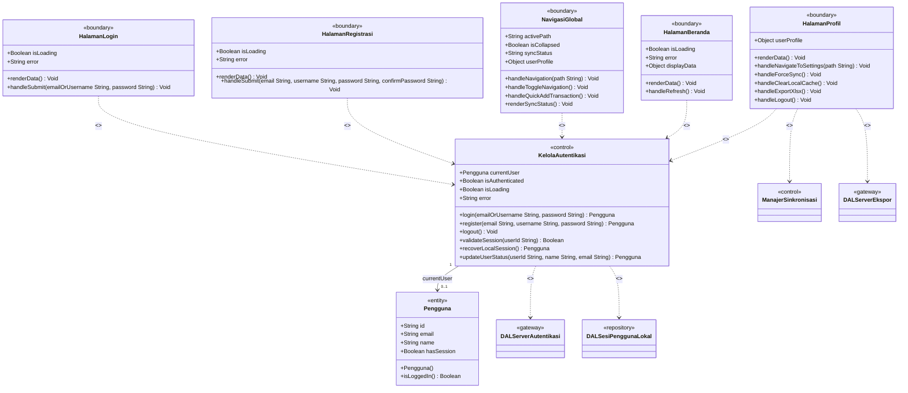

---

## Package 2 — Kelola Kategori

**User Story:** Pengguna dapat menambah, mengubah, dan menghapus kategori transaksi beserta ikon dan warna representasinya.

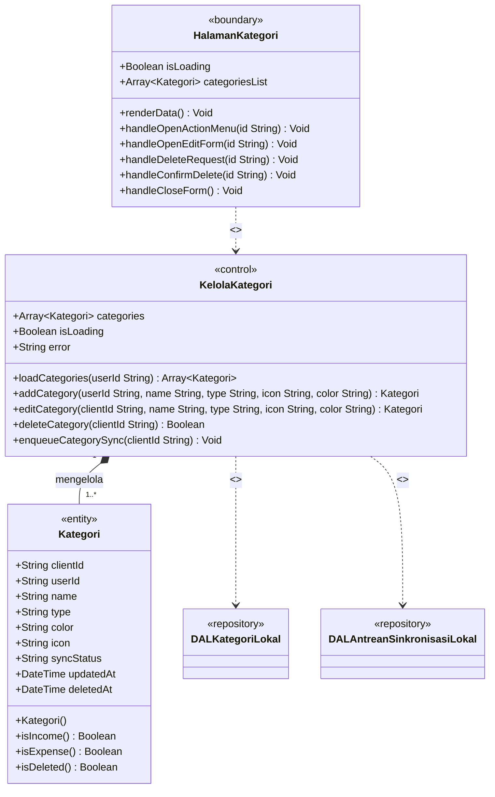

---

## Package 3 — Kelola Dompet

**User Story:** Pengguna dapat menambah, mengubah, dan menghapus sumber dana (dompet), serta melihat saldo berjalan dan mencatat transfer antar dompet.

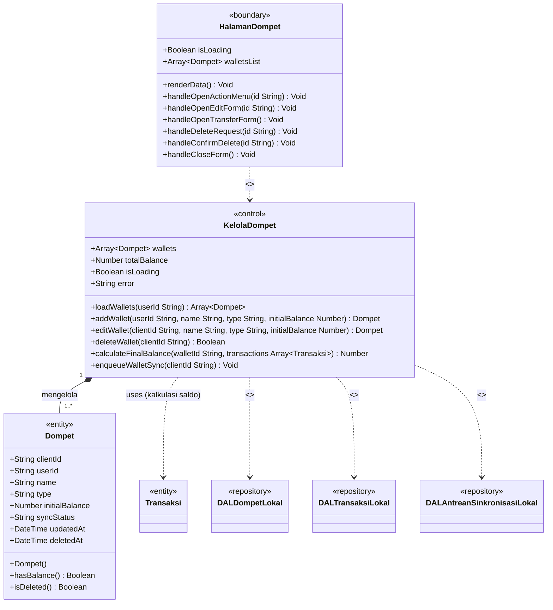

---

## Package 4 — Kelola Transaksi

**User Story:** Pengguna dapat mencatat, mengubah, dan menghapus transaksi keuangan (pemasukan, pengeluaran, dan transfer antar dompet).

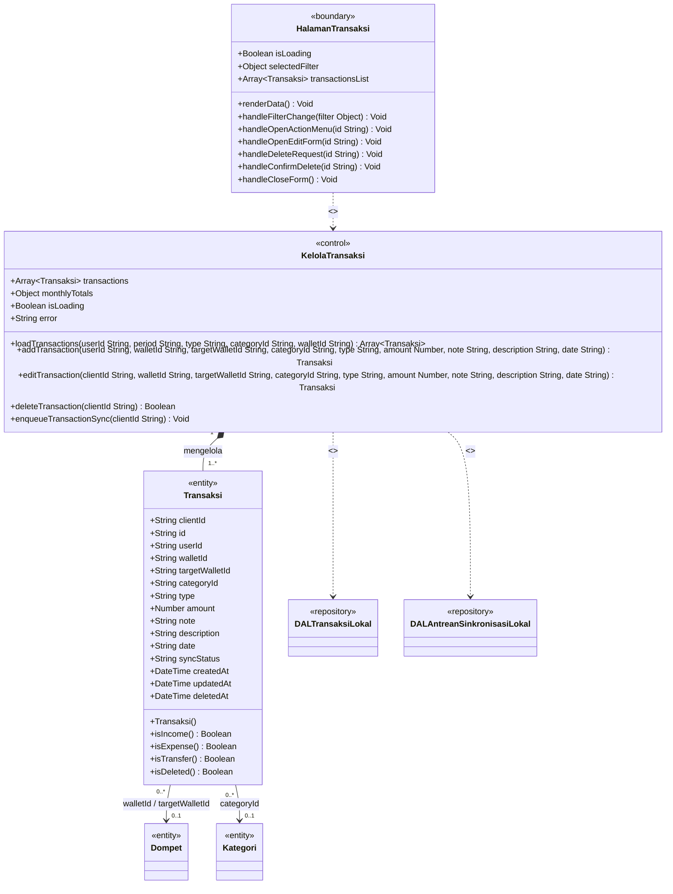

---

## Package 5 — Kelola Anggaran

**User Story:** Pengguna dapat menetapkan batas pagu pengeluaran bulanan per kategori, memantau serapannya, dan melakukan realokasi anggaran antar kategori (subsidi silang).

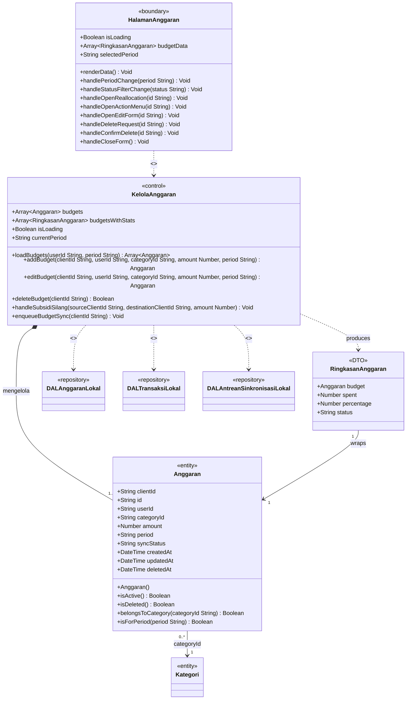

---

## Package 6 — Kelola Target Finansial

**User Story:** Pengguna dapat menetapkan, memantau, dan mengelola target akumulasi pendapatan dalam periode tertentu.

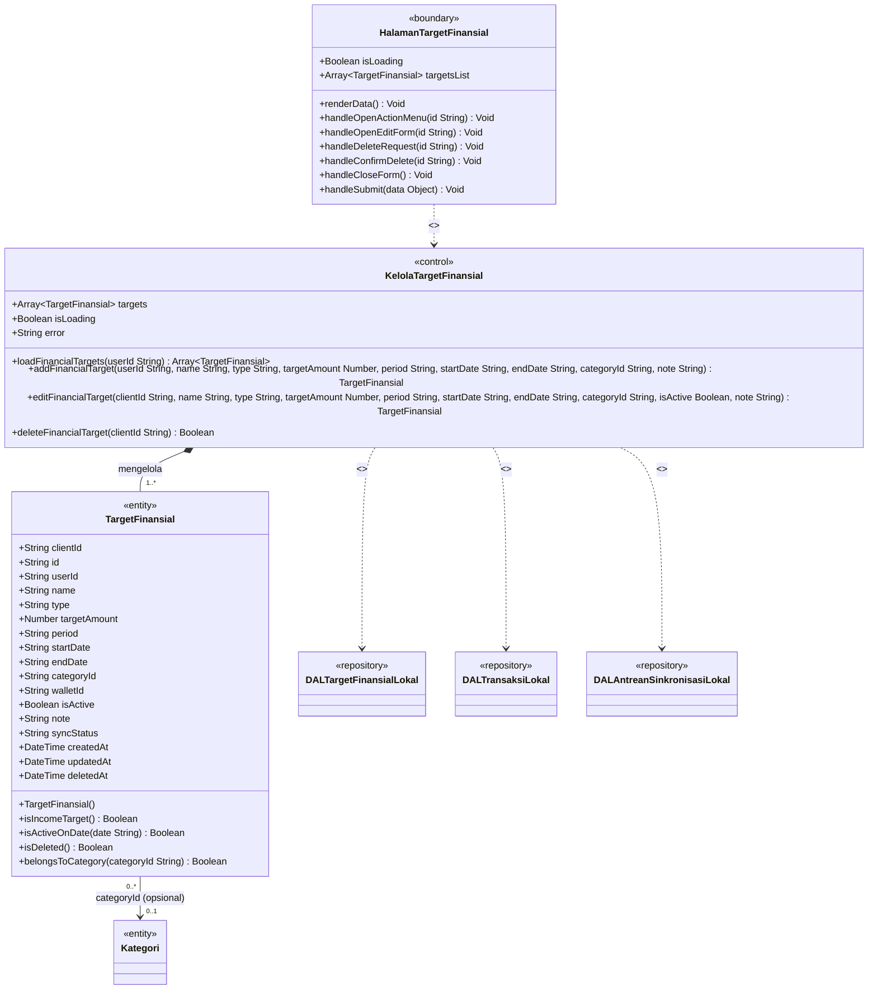

---

## Package 7 — Analisis dan Insight

**User Story:** Pengguna dapat melihat ringkasan performa keuangan bulanan dalam bentuk grafik, distribusi kategori, tren, dan rekomendasi finansial berbasis aturan.

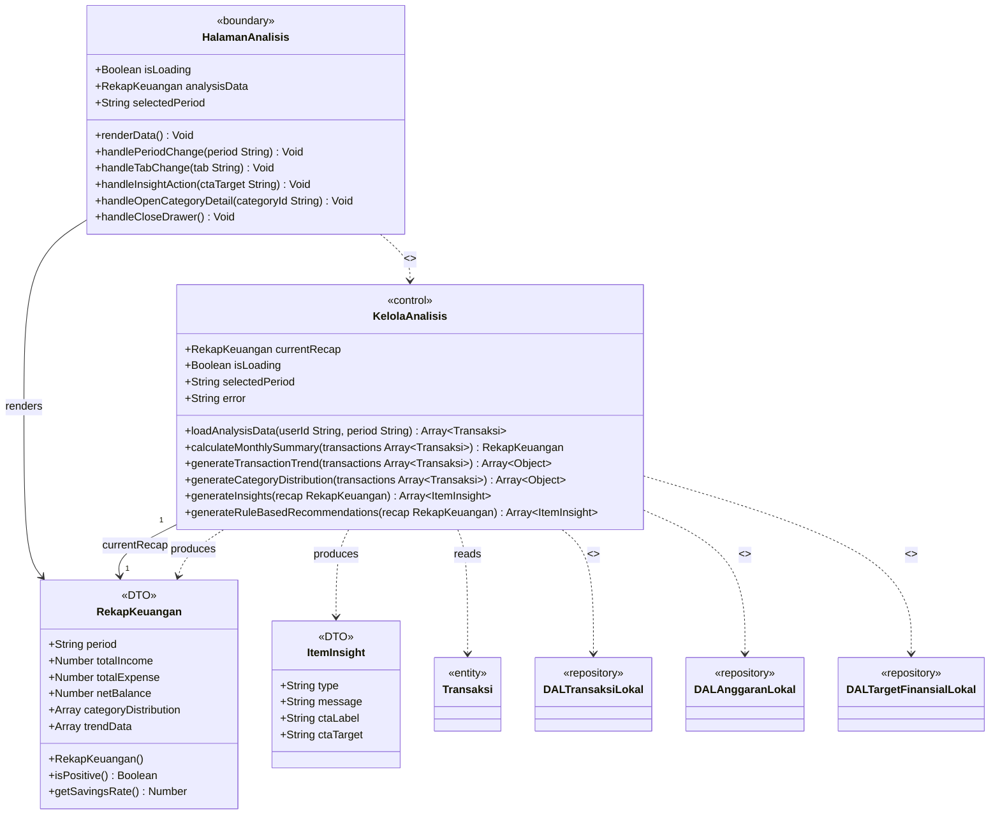

---

## Package 8 — Notifikasi

**User Story:** Pengguna dapat menerima peringatan otomatis berbasis kondisi keuangan, membaca log notifikasi, dan mengatur preferensi serta izin push notification.

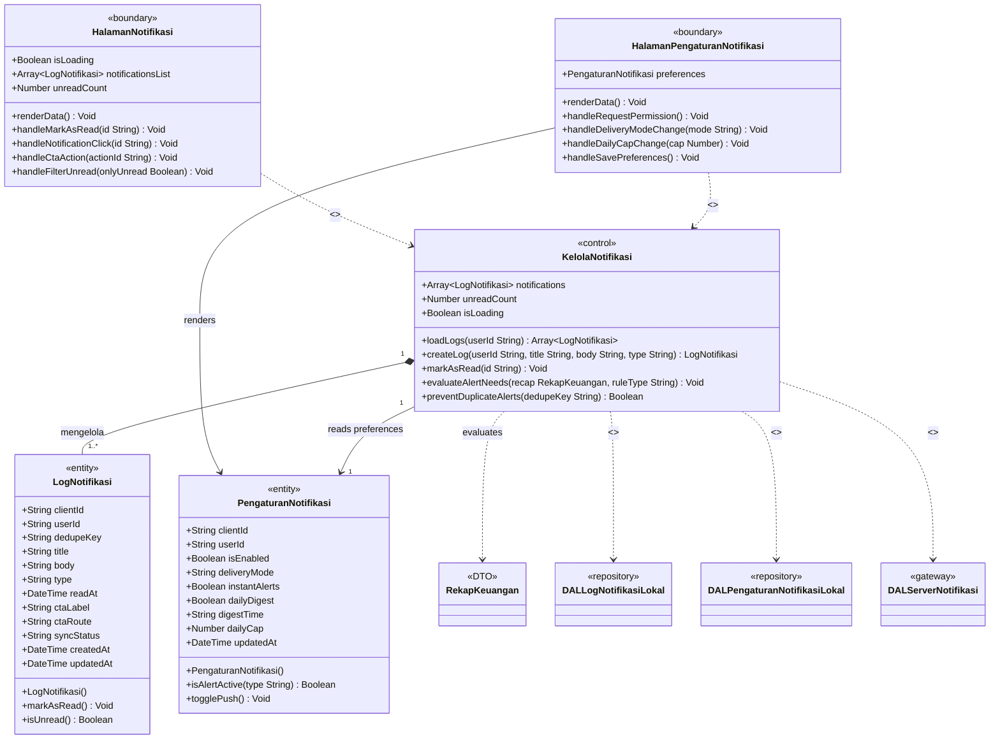

---

## Package 9 — Sinkronisasi Offline-first

**User Story:** Sistem secara otomatis mendeteksi koneksi jaringan dan menyinkronkan perubahan data lokal ke server cloud (push), serta menarik pembaruan dari server (pull) dengan resolusi konflik Last-Write-Wins.

> **Catatan khusus:** Package ini adalah layanan latar belakang (background service) yang tidak memiliki halaman UI khusus. Status sinkronisasi ditampilkan melalui `NavigasiGlobal` (`syncStatus`) di Package Autentikasi, dan sinkronisasi manual dapat dipicu dari `HalamanProfil`. Oleh karena itu, **tidak ada kelas `<<boundary>>` yang dimiliki sendiri** oleh package ini — ini adalah pengecualian yang wajar untuk package infrastruktur aktif.

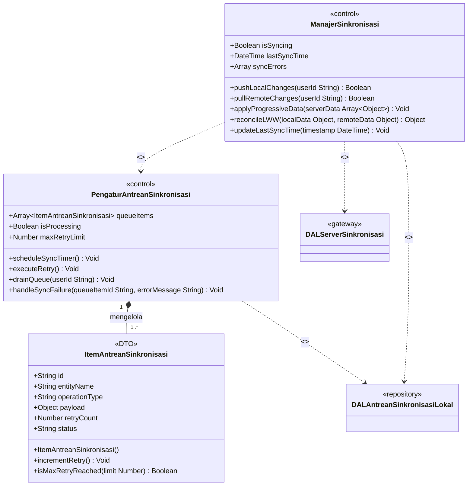

---

## Package 10 — Akses Data Lokal

**Peran Arsitektur:** Lapisan infrastruktur repository yang mengabstraksi seluruh operasi CRUD pada IndexedDB (penyimpanan luring peramban). Tidak merepresentasikan user story langsung.

> **Catatan:** Semua kelas `DAL*Lokal` standar mengimplementasikan kontrak fungsi yang seragam: `getAll()`, `getByClientId()`, `create()`, `update()`, `softDelete()`, `bulkUpsert()`. Dua kelas memiliki fungsi tambahan khusus.

```mermaid
classDiagram
    %% ── REPOSITORY STANDAR ──
    class DALKategoriLokal {
        <<repository>>
        +String storeName
        +getAll(userId String) Array~Kategori~
        +getByClientId(clientId String) Kategori
        +create(data Kategori) Kategori
        +update(clientId String, data Partial) Kategori
        +softDelete(clientId String) Boolean
        +bulkUpsert(dataList Array) Void
    }

    class DALDompetLokal {
        <<repository>>
        +String storeName
        +getAll(userId String) Array~Dompet~
        +getByClientId(clientId String) Dompet
        +create(data Dompet) Dompet
        +update(clientId String, data Partial) Dompet
        +softDelete(clientId String) Boolean
        +bulkUpsert(dataList Array) Void
    }

    class DALTransaksiLokal {
        <<repository>>
        +String storeName
        +getAll(userId String) Array~Transaksi~
        +getByClientId(clientId String) Transaksi
        +create(data Transaksi) Transaksi
        +update(clientId String, data Partial) Transaksi
        +softDelete(clientId String) Boolean
        +bulkUpsert(dataList Array) Void
    }

    class DALAnggaranLokal {
        <<repository>>
        +String storeName
        +getAll(userId String) Array~Anggaran~
        +getByClientId(clientId String) Anggaran
        +create(data Anggaran) Anggaran
        +update(clientId String, data Partial) Anggaran
        +softDelete(clientId String) Boolean
        +bulkUpsert(dataList Array) Void
    }

    class DALTargetFinansialLokal {
        <<repository>>
        +String storeName
        +getAll(userId String) Array~TargetFinansial~
        +getByClientId(clientId String) TargetFinansial
        +create(data TargetFinansial) TargetFinansial
        +update(clientId String, data Partial) TargetFinansial
        +softDelete(clientId String) Boolean
        +bulkUpsert(dataList Array) Void
    }

    class DALLogNotifikasiLokal {
        <<repository>>
        +String storeName
        +getAll(userId String) Array~LogNotifikasi~
        +getByClientId(clientId String) LogNotifikasi
        +create(data LogNotifikasi) LogNotifikasi
        +update(clientId String, data Partial) LogNotifikasi
        +softDelete(clientId String) Boolean
        +bulkUpsert(dataList Array) Void
    }

    class DALPengaturanNotifikasiLokal {
        <<repository>>
        +String storeName
        +getAll(userId String) Array~PengaturanNotifikasi~
        +getByClientId(clientId String) PengaturanNotifikasi
        +create(data PengaturanNotifikasi) PengaturanNotifikasi
        +update(clientId String, data Partial) PengaturanNotifikasi
        +softDelete(clientId String) Boolean
        +bulkUpsert(dataList Array) Void
    }

    %% ── REPOSITORY KHUSUS: Sesi Pengguna ──
    class DALSesiPenggunaLokal {
        <<repository>>
        +String storeName
        +saveSession(user Pengguna) Void
        +getSession() Pengguna
        +clearSession() Void
    }

    %% ── REPOSITORY KHUSUS: Antrean Sinkronisasi ──
    class DALAntreanSinkronisasiLokal {
        <<repository>>
        +String storeName
        +enqueueItem(entityName String, entityClientId String, operation String, payload Object) ItemAntreanSinkronisasi
        +getPendingItems(userId String) Array~ItemAntreanSinkronisasi~
        +updateRetryCount(queueItemId String, errorMessage String) Void
        +markAsSuccess(queueItemId String) Void
        +removeSyncedItems(userId String) Void
    }

    %% ── REFERENSI EKSTERNAL ──
    class ItemAntreanSinkronisasi {
        <<DTO>>
    }
    class Pengguna {
        <<entity>>
    }

    %% ── RELASI ──
    DALAntreanSinkronisasiLokal ..> ItemAntreanSinkronisasi : produces
    DALSesiPenggunaLokal ..> Pengguna : manages
```

---

## Package 11 — Akses Data Server

**Peran Arsitektur:** Lapisan gateway yang mengabstraksi seluruh komunikasi HTTP ke API Routes server (Next.js + PostgreSQL via Prisma). Tidak merepresentasikan user story langsung.

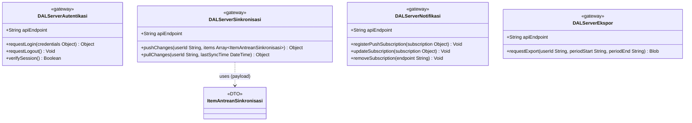

---

## Ringkasan Distribusi Kelas BCE per Package

| Package | Boundary | Control | Entity / DTO |
|---|---|---|---|
| **Autentikasi** | `HalamanLogin`, `HalamanRegistrasi`, `NavigasiGlobal`, `HalamanBeranda`, `HalamanProfil` | `KelolaAutentikasi` | `Pengguna` |
| **Kelola Kategori** | `HalamanKategori` | `KelolaKategori` | `Kategori` |
| **Kelola Dompet** | `HalamanDompet` | `KelolaDompet` | `Dompet` |
| **Kelola Transaksi** | `HalamanTransaksi` | `KelolaTransaksi` | `Transaksi` |
| **Kelola Anggaran** | `HalamanAnggaran` | `KelolaAnggaran` | `Anggaran`, `RingkasanAnggaran` |
| **Kelola Target Finansial** | `HalamanTargetFinansial` | `KelolaTargetFinansial` | `TargetFinansial` |
| **Analisis dan Insight** | `HalamanAnalisis` | `KelolaAnalisis` | `RekapKeuangan`, `ItemInsight` |
| **Notifikasi** | `HalamanNotifikasi`, `HalamanPengaturanNotifikasi` | `KelolaNotifikasi` | `LogNotifikasi`, `PengaturanNotifikasi` |
| **Sinkronisasi Offline-first** | *(background service — tidak ada UI langsung)* | `ManajerSinkronisasi`, `PengaturAntreanSinkronisasi` | `ItemAntreanSinkronisasi` |
| **Akses Data Lokal** | — | 9 `<<repository>>` | — |
| **Akses Data Server** | — | 4 `<<gateway>>` | — |
